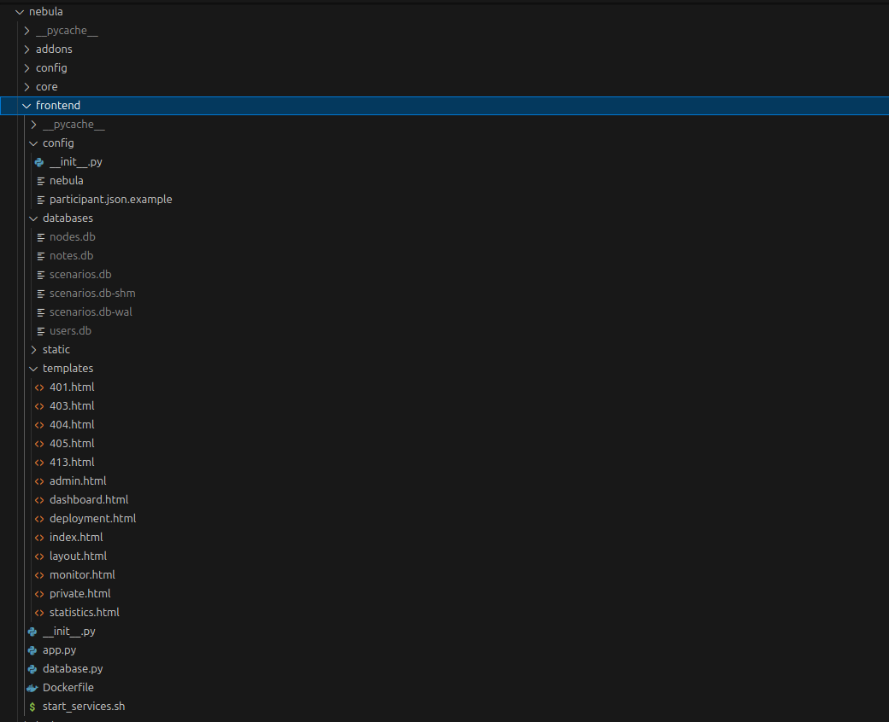

# Developer Guide

This guide is designed to help developers understand and contribute to the project. It provides detailed instructions on navigating the codebase, and implementing new features. Whether you're looking to fix bugs, add enhancements, or better understand the architecture, this guide will walk you through the essential processes and best practices for development.

## Table of Contents
-   [NEBULA FRONTEND](#nebula-frontend)
    - [Structure](#structure)
    - [Adding new parameters](#adding-new-parameters)
-   [NEBULA BACKEND](#nebula-backend)

## NEBULA Frontend


### Structure  
The frontend is organized within the `frontend/` directory. Key files and folders include:  

- `config/` → Contains the **participant.json.example**, the default structure for the paramteres passed to each node.
- `databases/` → Contains the different databases for NEBULA   
- `static/` → Holds static assets (CSS, images, JS, etc.).  
- `templates/` → Contains HTML templates. Focus on **deployment.html** 

### Adding a New Parameter  

Define the new parameter in the **participant.json.example** file. Only create a new field if necessary

```json
{
    "scenario_args": {
      "name": "",
      "start_time": "",
      "federation": "DFL",
      "rounds": 10,
      "deployment": "process",
      "controller": "127.0.0.1:5000",
      "random_seed": 42,
      "n_nodes": 0,
      /* New parameter in each setting */
      "new_parameter_key" : "new_parameter_value",
      "config_version": "development"
    },
    /* Add a new_field if necessary */
    "new_field": {
        "new_parameter_key" : "new_parameter_value"
    }
}
```

### Define the parameter on the **deployment.html**
For example, let's assume you want to implement a new attack type. Search for the section where attacks are defined and add the new attack option, as well as the new parameter for the attack. Below is an example of how to add the attack and its associated parameter.

```html
<div class="form-group row container-shadow tiny grey">
    <h5 class="step-number">Robustness <i class="fa fa-shield"></i>
        <input type="checkbox" tyle="display: none;">
        <label for="robustness-lock" class="icon-container" style="float: right;">
            <i class="fa fa-lock"></i>
        </label>
    </h5>
    <h5 class="step-title">Attack Type</h5>
    <div class="form-check form-check-inline">
        <select class="form-control" id="poisoning-attack-select" name="poisoning-attack">
            <option selected>No Attack</option>
            <option>New Attack</option> <!-- Add this -->
        </select>
        <h5 id="poisoned-node-title" class="step-title">
            % Malicious nodes
        </h5>
        <div class="form-check form-check-inline" style="display: none;" id="poisoned-node-percent-container">
            <input type="number" class="form-control" id="poisoned-node-percent"
                placeholder="% malicious nodes" min="0" value="0">
                <select class="form-control" id="malicious-nodes-select" name="malicious-nodes-select">
                <option selected>Percentage</option>
                <option>Manual</option>
            </select>
        </div>
        <h5 id="poisoned-node-title" class="step-title">
            % Malicious nodes
        </h5>
        <div class="form-check form-check-inline" style="display: none;" id="poisoned-node-percent-container">
            <input type="number" class="form-control" id="poisoned-node-percent"
                placeholder="% malicious nodes" min="0" value="0">
        </div>
        <h5 id="new-parameter-title" class="step-title"> <!-- Add this -->
            New parameter
        </h5>
        <div class="form-check form-check-inline" style="display: none;" id="new-parameter-container">
            <input type="number" class="form-control" id="new-parameter-value"
                placeholder="new parameter value" min="0" value="0"> 
        </div>
    </div>
</div>
```

To receive the parameter in nebula/scenarios.py. You need to modify the Scenario class to accept the new parameter.

```python
class Scenario:
    def __init__(
        self,
        scenario_title,
        scenario_description,
        new_paramater, # <--- Add this
    ):
        """
        Initialize the scenario.

        Args:
            scenario_title (str): Title of the scenario.
            scenario_description (str): Description of the scenario.
            new_parameter (type): Description of the new parameter.
        """
        self.scenario_title = scenario_title
        self.scenario_description = scenario_description
        self.new_parameter = new_parameter # <--- Add this
```

Now you must save the parameter in the node configuration.

The node configuration files are located in the **/app/config/ directory**. You'll need to ensure the new parameter is added to the participant's JSON file.

```python
    class ScenarioManagement:
    def __init__(self, scenario, user=None):
        # Save node settings
        for node in self.scenario.nodes:
            node_config = self.scenario.nodes[node]
            participant_file = os.path.join(self.config_dir, f"participant_{node_config['id']}.json")
            os.makedirs(os.path.dirname(participant_file), exist_ok=True)
            shutil.copy(
                os.path.join(
                    os.path.dirname(__file__),
                    "./frontend/config/participant.json.example",
                ),
                participant_file,
            )
            os.chmod(participant_file, 0o777)
            with open(participant_file) as f:
                participant_config = json.load(f)

            participant_config["network_args"]["ip"] = node_config["ip"]
            participant_config["network_args"]["port"] = int(node_config["port"])
            # In case you are adding a parameter to a previously defined functionality
            participant_config["data_args"]["new_parameter"] = self.scenario.new_parameter
            # In case you are creating a new functionality
            participant_config["new_field"]["new_parameter"] = self.scenario.new_parameter
```

## NEBULA Backend

This section would describe backend-specific instructions for adding new functionality, working with data, and handling interactions between components.