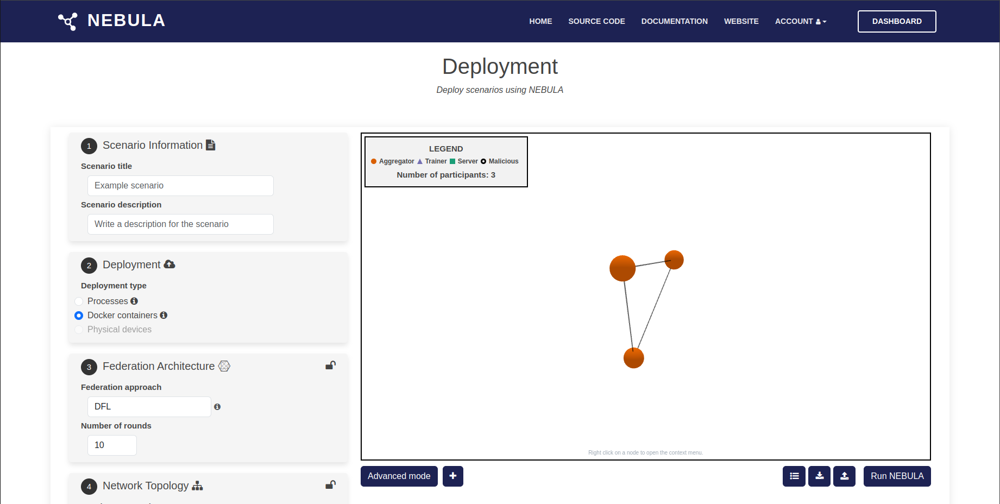
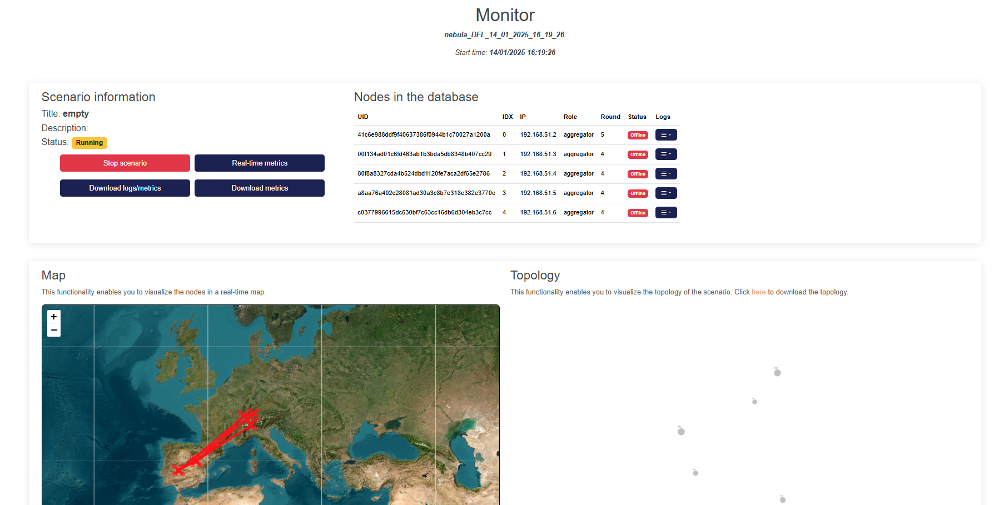

# User Guide

In this section, we will explain how to use the NEBULA Platform

## Table of contents

-   [Running NEBULA](#running-nebula)
-   [NEBULA Frontend](#nebula-frontend)
-   [Deployment of scenarios](#deployment-of-scenarios)
-   [NEBULA Dashboard](#dashboard)
-   [Monitor](#monitor)
-   [Realtime metrics](#realtime-metrics)

## Running NEBULA
 

To run NEBULA, you can use the following command line:

    python app/main.py [PARAMS]

The first time you run the platform, the nebula-frontend docker image
will be built. This process can take a few minutes.

You can show the PARAMS using:

    python app/main.py --help

The frontend will be available at http://127.0.0.1:6060 (by default) if the port is available

To change the default port of the frontend, you can use the following
command line:

    python app/main.py --webport [PORT]

To change the default port of the statistics endpoint, you can use the
following command line:

    python app/main.py --statsport [PORT]

## NEBULA Frontend

### Top Navigation Bar Buttons

- **HOME** – Returns to the main landing page of NEBULA.
- **SOURCE CODE** – Redirects to the NEBULA's repository.
- **DOCUMENTATION** – Provides access to NEBULA's official documentation, including installation, usage, and API references.
- **WEBSITE** – Redirects to NEBULA's official website.
- **ACCOUNT** – Contains user-related options such as login, logout, and account settings.
- **DASHBOARD** – Takes users to the main dashboard where they can interact with NEBULA's features.

### Feedback Section

- **Send Feedback** – - **Send Feedback** – You can send us feedback through this button, sharing how you use NEBULA and helping improve the platform through community engagement.

## Deployment of Scenarios

Here you can define the different parameters used to deploy the federation of nodes

### Nodes graph
It represents the **topology of the nodes**. In this graph, nodes can be selected and modified based on their role. The available options include:

- **Modify node type**: Specific nodes can be selected and assigned roles such as:
  - **Malicious** nodes
  - **Aggregator** nodes

- **Modify topology**: The connections between nodes can be altered to change the structure of the network. The actions available are:
  - **Add links**: New connections can be created between selected nodes by right-clicking.
  - **Remove links**: Existing connections between nodes can be deleted by clicking on the link.

### Buttons and Actions  

#### Add Scenario  
Allows users to create a new scenario.  

- **Functionality**:  
  - Opens a form to configure a new scenario.  
  - Users can define settings such as title, description, and deployment type.  

#### Advanced Mode  
Expands additional configuration options for nodes (from section 8 onwards).  

- **Functionality**:  
  - When enabled, displays advanced settings:  
    - [Participants](#8-participants)  
    - [Advanced Topology](#9-advanced-topology)  
    - [Advanced Training](#10-advanced-training)  
    - [Robustness](#11-robustness)  
    - [Defense](#12-defense)  
    - [Mobility](#13-mobility)  

#### Generate Scenario List  
Displays a list of all created scenarios.  

- **Functionality**:  
  - Retrieves and shows existing scenarios.  
  - Allows users to select or modify a scenario.  

#### Load and Save Configuration (JSON)  
Provides options to import/export scenario configurations using JSON.  

- **Load JSON**:  
  - Allows users to upload a JSON file to load scenario configurations.  

- **Download Configuration**:  
  - Exports the current scenario settings into a JSON file.  

#### Run Federation  
Starts the federation process with the selected configuration.  

- **Functionality**:  
  - Launches the training and aggregation process.  
  - Executes the configured rounds with the chosen models and dataset.  

### 1. Scenario Information  
Define general information about the scenario.  

- **Scenario title**: Set a name for the scenario.  
- **Scenario description**: Provide a description for the scenario.  

### 2. Deployment  
Select how the scenario will be deployed.  

- **Deployment type**:
  - Processes  
  - Docker containers  
  - Physical devices  

### 3. Federation Architecture  
Configure the architecture of the federation.  

- **Federation approach**: Select the approach (e.g., DFL).  
- **Number of rounds**: Define the number of training rounds.  

### 4. Network Topology  
Set up the network topology for participants.  

- **Topology generation**:
  - Custom topology  
  - Predefined topology (e.g., Fully)  
- **Number of nodes**: Specify the number of participants.  

### 5. Dataset  
Configure dataset-related settings.  

- **Federated dataset**: Select the dataset (e.g., MNIST).  
- **Dataset type**: Choose between IID or Non-IID distribution.  
- **Partition methods**: Set the partition strategy (e.g., Dirichlet).  
- **Parameter setting**: Adjust parameters for data partitioning.  

### 6. Training  
Define the training model.  

- **Model**: Choose the model architecture (e.g., MLP).  

### 7. Aggregation  
Configure the aggregation method.  

- **Aggregation algorithm**: Select an aggregation algorithm (e.g., FedAvg).  

### 8. Participants
Configure the participants involved in the federation.

- **Logging**: Choose the type of logs to be recorded (e.g., alerts and logs).
- **Reporting**: Enable or disable reporting for the participants.
- **Individual participants**: View details or start specific participants manually.

### 9. Advanced Topology
Define the spatial distribution of participants.

- **Distance between participants**: Adjust the distance between nodes in the topology.

### 10. Advanced Training
Set additional training parameters.

- **Number of Epochs**: Define the number of training epochs for each participant.

### 11. Robustness
Configure the robustness of the federation by specifying potential attacks.

- **Attack Type**: Choose from different types of attacks or select "No Attack" for a standard setup.

### 12. Defense
Enable or disable security mechanisms for the federation.

- **Reputation System**: Choose whether to enable or disable reputation-based security.

### 13. Mobility
Manage the mobility settings for participants.

- **Default location selection**: Set participant locations as random or custom.
- **Mobility configuration**: Enable or disable participant mobility.

## Dashboard  

The NEBULA Dashboard provides an overview of the current federation scenarios and allows users to manage and monitor them effectively. Below is an explanation of the key components and buttons visible on the dashboard.

### Current Scenario Status  
- **Scenario name:** Displays the name of the currently running scenario.  
- **Scenario title and description:** Shows the title and description provided during the scenario creation.  
- **Scenario start time:** Indicates when the scenario was initiated.  

#### Buttons:  
- **Deploy new scenario:**  
  Use this button to create and deploy a new federation scenario. It redirects you to the scenario configuration interface.  
- **Compare scenarios:**  
  Allows you to compare the results of completed scenarios. Useful for analyzing performance differences.

### Scenarios in the Database  
This section provides a table summarizing all scenarios in the database.  

#### Columns:  
- **User:** Shows the user who created the scenario.  
- **Title:** Displays the scenario title.  
- **Start time:** Indicates when the scenario was started.  
- **Model:** The model being used for training (e.g., MLP).  
- **Dataset:** The dataset used in the scenario (e.g., MNIST).  
- **Rounds:** The number of training rounds configured.  
- **Status:** Indicates whether the scenario is running, stopped, or completed.  

#### Buttons in the "Action" Column:  
- **Monitor:**  
  Opens the monitoring interface for the selected scenario, showing metrics like accuracy and loss over time.  

- **Real-time metrics:**  
  Displays live updates of training metrics while the scenario is running.  

- **Save Note:**  
  Allows you to save custom notes or observations related to the scenario for future reference.

- **Scenario Config:**  
  Opens the configuration details of the selected scenario, allowing you to review the parameters used during its creation.    

- **Stop scenario:**  
  Immediately halts the execution of the selected scenario.

## Monitor

### Scenario Information  
This section provides a summary of the scenario's metadata and controls for managing it.  

- **Title:** Displays the name of the scenario.  
- **Description:** A brief description of the scenario's purpose or configuration.  
- **Status:** Indicates whether the scenario is *Running*, *Completed* or *Stopped*.  

### Buttons  
- **Stop Scenario:** Halts the execution of the currently running scenario.  
- **Real-time Metrics:** Redirects you to the [real-time metrics dashboard](#nebula-realtime-metrics) to monitor the scenario's performance.  
- **Download Logs/Metrics:** Downloads logs and metrics data for further analysis.  
- **Download Metrics:** Allows you to save metric data separately in your local environment.  

### Nodes in the Database  
This table summarizes all nodes participating in the scenario.  

### Columns  
- **UID:** A unique identifier for each node.  
- **IDX:** The index of the node in the scenario.  
- **IP:** The IP address of the node.  
- **Role:** Indicates the role of the node (e.g., aggregator).  
- **Round:** Specifies the current round of operation for the node.  
- **Status:** Displays whether the node is *Online* or *Offline*.  
- **Logs:** A button to access detailed logs for each node.  

### Map  
A real-time visualization of the nodes and their interactions displayed on a map.  

- **Purpose:** Provides a geographical representation of node distributions and connections.  
- **Features:**  
  - Interactive map with zoom and pan functionality.  
  - Visualizes active nodes and their interactions with connecting lines.  

### Topology  
This section illustrates the network topology of the scenario.  

- **Purpose:** Shows the relationships and interactions between nodes in a structured topology.  
- **Download:** You can click the "here" link to download a detailed representation of the topology.  

## Realtime Metrics

#### **Available Tabs**  
1. **Time Series:**  

   - Displays graphs of metrics recorded during the execution.  
   - Each graph is interactive, enabling comparison of metrics across participants or scenarios.  
   - Main options:  
     - **Filters:** Use regex to select the runs to display.  
     - **Axes:** Configure the horizontal axis (step, relative, wall).  
     - **Smoothing:** Adjust the curve using a slider.

   - Example metrics:  
     - *Test (Global)/Accuracy*  
     - *Test (Global)/F1Score*

2. **Scalars:**  

   - Similar to the Time Series tab but focused on global scalar values, such as accuracy and loss over iterations.

3. **Images (Confusion Matrix):**  

   - Displays the confusion matrix generated during the execution.  
   - Used to evaluate the classification performance of the models.  
   - Each matrix is specific to a participant or global metrics.

#### **Configuration Options:**  
- **Smoothing:** Adjusts the visualization of the curves.  
- **Ignore outliers:** Excludes outlier values in the graphs for a clearer representation.  
- **Card size:** Modifies the size of the graphs.
